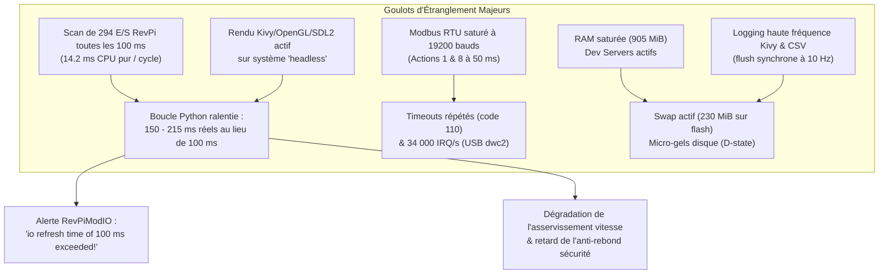
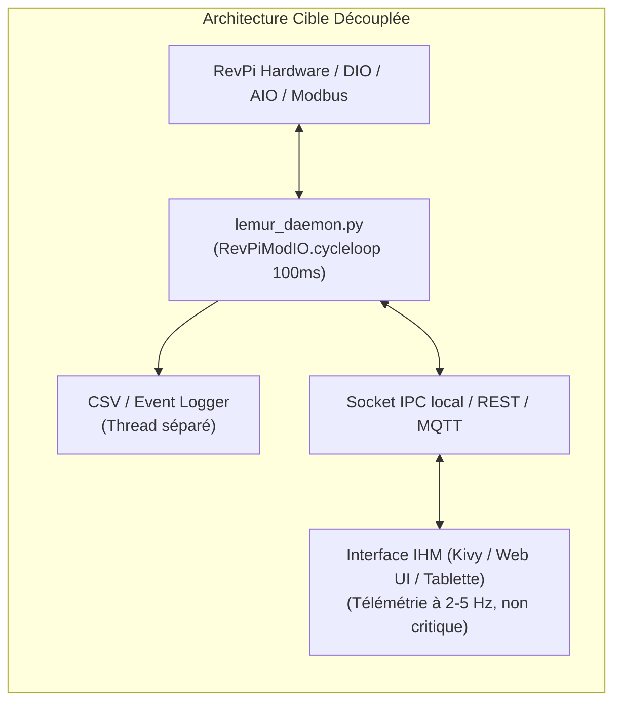

# Rapport d'Analyse de Performance & Spécifications d'Optimisation
## Projet ISSUL-LeMur sur Kunbus RevPi Connect

> **Destinataire** : Agent Antigravity (`agy`) / Équipe de développement ISSUL-LeMur  
> **Date de profilage** : 11 septembre 2026  
> **Contexte** : Mesures en conditions réelles (tapis en fonctionnement, mode headless/kiosk)  
> **Environnement** : Kunbus RevPi Connect (CM3+ 4x ARM Cortex-A53 @ 1.2 GHz, 905 MiB RAM, eMMC/SD)

---

## 1. Synthèse Exécutive & Diagnostic Mesuré

Lors d'un fonctionnement actif du tapis avec acquisition et régulation, le système présente un **dépassement critique du budget temps réel** et une **saturation des ressources matérielles**.



### Métriques Clés Mesurées en Direct

| Métrique | Valeur Observée | Cible Recommandée | Impact / Sévérité |
| :--- | :--- | :--- | :--- |
| **Cycle time Python (`update_values`)** | **150 – 215 ms** | **100 ms ± 5 ms** | **Critique** (Désynchronisation régulation) |
| **Alerte `RevPiModIO`** | `io refresh time exceeded!` | Aucune alerte | **Critique** (Buffer de rafraîchissement dépassé) |
| **Temps scan 294 E/S (`get_system_info`)** | **14,25 ms / cycle** | **< 0.1 ms** (lazy) | **Haute** (~15% d'un cœur CPU gaspillé) |
| **Volume de logs Kivy** | **> 12 500 lignes / 25 min** | Mode Warning / Event | **Haute** (I/O disque flash continu à 10 Hz) |
| **Erreurs Modbus RTU** | Code 110 continu (Timeout) | 0 erreur en régime | **Moyenne-Haute** (Bande passante saturée) |
| **Taux d'interruptions système** | **~34 000 IRQ / s** | < 5 000 IRQ / s | **Moyenne** (USB FTDI + dwc2 + arch_timer) |
| **Changements de contexte (`cs`)** | **~51 000 / s** | < 10 000 / s | **Moyenne** (Sur-ordonnancement CPU) |
| **Swap mémoire utilisé** | **~230 MiB** | **0 MiB** | **Haute** (I/O wait sur mémoire flash) |

---

## 2. Analyse Détaillée des Causes Racines

### A. La boucle de contrôle Python dépasse son échéance temporelle
Dans [`main.py`](file:///home/pi/ISSUL-LeMur/main.py#L259) :
```python
Clock.schedule_interval(self.update_values, self.update_period)  # update_period = 0.1s
```
L'analyse des horodatages du fichier CSV généré ([`log/2026/09/11/*_sujet_manual_test-log.csv`](file:///home/pi/ISSUL-LeMur/log/2026/09/11/2026-09-11-145822-664296_sujet_manual_test-log.csv)) montre que les pas réels mesurés sont de **150 ms à 215 ms**.  
Le module `revpimodio2/helper.py` déclenche à répétition :
> `RuntimeWarning: io refresh time of 100 ms exceeded!`

**Conséquences directes** :
1. L'asservissement en vitesse (rampe d'accélération et correcteur intégral de dérive dans [`treadmill.py`](file:///home/pi/ISSUL-LeMur/treadmill.py#L380-L417)) intègre un $\Delta t$ variable et décalé.
2. Le filtre anti-rebond optique (3 cycles = 300 ms prévus dans [`main.py`](file:///home/pi/ISSUL-LeMur/main.py#L307)) prend en réalité entre **450 ms et 650 ms** pour couper le tapis en cas d'alerte sécurité.

---

### B. Le scan inconditionnel des 294 E/S RevPi
Dans [`hardware.py`](file:///home/pi/ISSUL-LeMur/hardware.py#L278-L299), la méthode `get_system_info()` parcourt systématiquement :
```python
for dev in self.rpi.device:
    for io in dev:
        all_ios.append({
            "device": str(dev_name),
            "name": str(io.name),
            "value": io.value,  # Propriété revpimodio2 accédant au process image
            ...
        })
```
* Le RevPi Connect dispose de **3 modules** totalisant **294 E/S**.
* Benchmark exécuté sur la machine : ce double parcours + allocations prend **14,25 ms de CPU pur**.
* Cette méthode est invoquée **toutes les 100 ms** par [`system_info_widget.update_info()`](file:///home/pi/ISSUL-LeMur/system_info_widget.py#L106), elle-même appelée inconditionnellement à la ligne 298 de [`main.py`](file:///home/pi/ISSUL-LeMur/main.py#L298), **même lorsque l'utilisateur est sur l'onglet `manual_tab` ou en mode headless**.

---

### C. Invalidation continue de l'arbre Kivy (30 Propriétés par cycle)
Dans [`system_info_widget.py`](file:///home/pi/ISSUL-LeMur/system_info_widget.py#L114-L200), `update_info()` réassigne à chaque cycle environ 30 propriétés Kivy (`StringProperty`, `ColorProperty`, `BooleanProperty`).  
Bien que l'onglet ne soit pas affiché, les liaisons Kivy (`bind` KV) sont évaluées et marquent les widgets comme sales, consommant des cycles CPU au sein du thread principal.

---

### D. Saturation d'E/S Disque & Logging Verbeux
1. **Logs Kivy à 10 Hz** :
   Dans [`hardware.py`](file:///home/pi/ISSUL-LeMur/hardware.py#L174) :
   ```python
   Logger.info("Belt frequency updated : " + str(value/100))
   ```
   Cette ligne génère un message formaté et écrit sur la mémoire flash du RevPi 10 fois par seconde (fichier [`~/.kivy/logs/kivy_*.txt`](file:///home/pi/.kivy/logs/kivy_26-09-11_0.txt) dépassant 12 500 lignes en 25 minutes).
2. **`flush()` synchrone sur chaque point CSV** :
   Dans [`treadmill.py`](file:///home/pi/ISSUL-LeMur/treadmill.py#L178) :
   ```python
   if self.log_queue.qsize() == 0:
       self.log_file.flush()
   ```
   À 10 Hz, la file est vide quasiment après chaque écriture. Le thread déclenche donc un `flush()` synchrone à chaque échantillon, forçant des écritures physiques continues sur la carte flash (`mmcblk0`).

---

### E. Conflits et Saturation sur le Bus Modbus RTU (19 200 bauds)
* Fichier de configuration : `/var/www/revpi/pictory/projects/_config.rsc`
* Le bus RS-485 (`/dev/ttyRS485` relié à `/dev/ttyUSB0`) tourne à **19 200 bauds** (~1 920 octets/s bruts).
* Deux actions sont configurées avec un intervalle de **50 ms** :
  * **Action 1** : Écriture consigne variateur (`belt_speed_SP_0`, 2 registres, FC16)
  * **Action 8** : Lecture retour vitesse encodeur (`encoder_feedback_speed`, 1 registre, FC3)
* Plusieurs autres actions (Action 2 à 300 ms, Action 5 à 100 ms, Action 4 à 200 ms, Action 9 à 300 ms) s'y ajoutent.
* **Conséquence** : Collisions temporelles régulières et erreurs Modbus timeout (code `110`) inondant `systemd-journald` et `rsyslogd`.
* De plus, le paramètre système `latency_timer` du convertisseur FTDI (`/sys/bus/usb-serial/devices/ttyUSB0/latency_timer`) est resté à **16 ms** (valeur par défaut inadaptée au temps réel au lieu de 1 ms).

---

### F. Paradigme « Headless » vs Moteur Graphique Kivy
Le système est exécuté en console kiosk (`tty1`) via [`lemur.sh`](file:///home/pi/lemur.sh#L2) et [`main.py`](file:///home/pi/ISSUL-LeMur/main.py#L559).  
Le moteur Kivy complet est instancié avec :
* Backend SDL2 + OpenGL ES 2.1 via `/dev/dri/card0`
* 4 écouteurs d'événements d'entrée Linux (`/dev/input/event0, 2, 3`, mouse)
* Polling graphique constant (même cappé à `maxfps = 10`)
* **Problème** : Si le système a vocation à opérer sans supervision humaine sur écran ou en tâche de fond industrielle pure, faire reposer l'asservissement du tapis et la sécurité sur la boucle d'événements d'un moteur graphique GUI génère une surcharge CPU/RAM et un risque d'instabilité important.

---

### G. Concurrence Mémoire (Dev Servers en Production)
Le RevPi ne dispose que de **905 MiB** de RAM physique.  
L'exécution simultanée des serveurs de développement à distance :
* `vscodium-server` (~150 MiB)
* `agy` CLI (~300 MiB)
* `python` / Kivy (~100–160 MiB)
pousse le système au-delà de 1 Go et force le noyau à swapper **~230 MiB** sur le stockage flash. Le thread Python subit des suspensions (états `D` - Uninterruptible Sleep) dès qu'il touche des pages swappées.

---

## 3. Plan d'Optimisation & Spécifications des Tickets

Voici les 7 tickets prêts pour implémentation par `agy`.

### Ticket 1 (Priorité P0) : Scan Paresseux des 294 E/S RevPi
* **Fichier cible** : [`hardware.py`](file:///home/pi/ISSUL-LeMur/hardware.py#L238-L308)
* **Objectif** : Ne jamais parcourir `self.rpi.device` sauf si l'onglet explorateur est explicitement ouvert.
* **Gain attendu** : **-14 ms de temps CPU par cycle de 100 ms (-15% de CPU)**.

#### Implémentation préconisée :
```python
def get_system_info(self, include_all_ios=False):
    """Returns diagnostic dictionary. IO enumeration is lazy to protect cycle time."""
    # 1. Lecture rapide des E/S et Modbus indispensables (inchangé)
    outputs = { ... }
    inputs = { ... }
    modbus = { ... }

    # 2. Énumération conditionnelle
    all_ios = []
    if include_all_ios:
        try:
            for dev in self.rpi.device:
                dev_name = getattr(dev, 'name', f"Pos {getattr(dev, 'position', '?')}")
                for io in dev:
                    io_type_str = "MEM"
                    if hasattr(io, 'type'):
                        if io.type == revpimodio2.INP:
                            io_type_str = "INP"
                        elif io.type == revpimodio2.OUT:
                            io_type_str = "OUT"
                    all_ios.append({
                        "device": str(dev_name),
                        "name": str(io.name),
                        "value": io.value,
                        "type": io_type_str,
                        "address": getattr(io, 'address', 0),
                        "length": getattr(io, 'length', 1),
                    })
        except Exception as e:
            Logger.debug(f"Hardware: Could not enumerate all IOs: {e}")

    return {
        "connected": True,
        "cycletime_ms": getattr(self.rpi, 'cycletime', config.get('CYCLETIME_MS', 100)),
        "ioerrors": getattr(self.rpi, 'ioerrors', 0),
        "outputs": outputs,
        "inputs": inputs,
        "modbus": modbus,
        "all_ios": all_ios,
    }
```

---

### Ticket 2 (Priorité P0) : Mise à Jour de `SystemInfoWidget` Uniquement à la Visibilité
* **Fichiers cibles** : [`main.py`](file:///home/pi/ISSUL-LeMur/main.py#L297-L299), [`system_info_widget.py`](file:///home/pi/ISSUL-LeMur/system_info_widget.py#L106-L112)
* **Objectif** : Éviter les recalculs de télémétrie UI et les dirty marks Kivy quand l'onglet n'est pas à l'écran.

#### Implémentation dans [`main.py`](file:///home/pi/ISSUL-LeMur/main.py#L297-L299) :
```python
# update system info widget UNIQUEMENT si l'onglet est affiché
if (hasattr(self, 'system_info_widget') and self.system_info_widget
        and self.screen_manager.current == 'system_info_tab'):
    # Passer include_all_ios=True uniquement si en sous-vue 'explorer'
    want_explorer = getattr(self.system_info_widget, 'view_mode', 'summary') == 'explorer'
    self.system_info_widget.update_info(include_all_ios=want_explorer)
```

#### Implémentation dans [`system_info_widget.py`](file:///home/pi/ISSUL-LeMur/system_info_widget.py#L106-L112) :
```python
def update_info(self, include_all_ios=False):
    if not self.treadmill:
        return

    info = self.treadmill.get_system_info(include_all_ios=include_all_ios)
    if not info:
        return
    ...
```
*(Et propager l'argument `include_all_ios` dans [`treadmill.py`](file:///home/pi/ISSUL-LeMur/treadmill.py#L615) : `def get_system_info(self, include_all_ios=False): return self.hardware.get_system_info(include_all_ios)`).*

---

### Ticket 3 (Priorité P1) : Élagage du Logging & Temporisation des Flushes Disque
* **Fichiers cibles** : [`hardware.py`](file:///home/pi/ISSUL-LeMur/hardware.py#L174), [`treadmill.py`](file:///home/pi/ISSUL-LeMur/treadmill.py#L175-L181)
* **Objectif** : Soulager l'I/O de la flash eMMC/SD et supprimer 600 écritures de logs par minute.

#### 1. Supprimer le log de fréquence redondant dans [`hardware.py`](file:///home/pi/ISSUL-LeMur/hardware.py#L167-L175) :
```python
def set_belt_speed(self, V_kmh):
    value = V_kmh * config['BELT_MAX_FREQUENCY_HZ'] * 100 / config['BELT_MAX_SPEED_KMH']
    value = value * 1.8
    value = round(config['BELT_KMH2HZ_factor'] * value)
    
    # Écriture dans le bus process image
    self.rpi.io.belt_speed_SP_0.value, self.rpi.io.belt_speed_SP_1.value = split_value(value)
    
    # REMPLACÉ : Logger.debug au lieu de Logger.info (ou loguer uniquement si la valeur change)
    # Logger.debug("Belt frequency updated : " + str(value/100))
```

#### 2. Remplacer le `flush()` systématique dans [`treadmill.py`](file:///home/pi/ISSUL-LeMur/treadmill.py#L166-L184) :
```python
def _log_worker(self):
    """Worker thread for writing logs to file."""
    Logger.info("Treadmill: Log worker thread started.")
    last_flush = time()
    while not self.stop_logging_thread.is_set():
        try:
            log_data = self.log_queue.get(timeout=0.1)
            if log_data is None:
                break
            if self.log_writer:
                self.log_writer.writerow(log_data)
                # Flush temporisé toutes les 2.0 secondes au lieu de chaque point (10 Hz)
                now = time()
                if now - last_flush >= 2.0:
                    self.log_file.flush()
                    last_flush = now
            self.log_queue.task_done()
        except queue.Empty:
            continue
    if self.log_file:
        self.log_file.flush()
    Logger.info("Treadmill: Log worker thread stopped.")
```

---

### Ticket 4 (Priorité P1) : Décimation des Points Graphiques en Mode Incrémental
* **Fichier cible** : [`incremental_widget.py`](file:///home/pi/ISSUL-LeMur/incremental_widget.py#L409-L426)
* **Objectif** : Éviter l'allocation et la projection GPU de 16 200 tuples à 10 Hz.

#### Implémentation :
```python
def update_graph_dot(self, treadmill_points):
    if not self.current_dot:
        self.current_dot = MeshLinePlot(color=[1, 1, 0, 1])
        self.graph.add_plot(self.current_dot)

    time_value = treadmill_points[-1]['time'] if treadmill_points else 0
    self.current_dot.points = [(time_value, -1e9), (time_value, 1e9)]

    if not self.actual_plot:
        self.actual_plot = MeshLinePlot(color=[0, 1, 1, 1])
        self.graph.add_plot(self.actual_plot)

    # Optimisation : sous-échantillonnage de la trace affichée (max 500 points sur l'écran)
    total_pts = len(treadmill_points)
    if total_pts > 500:
        step = max(1, total_pts // 500)
        sliced = [treadmill_points[i] for i in range(0, total_pts, step)]
        if treadmill_points[-1] not in sliced:
            sliced.append(treadmill_points[-1])
        self.actual_plot.points = [(p['time'], p[self.graph_variable]) for p in sliced]
    else:
        self.actual_plot.points = [(p['time'], p[self.graph_variable]) for p in treadmill_points]
```

---

### Ticket 5 (Priorité P1) : Optimisation du Bus Modbus RTU & Port FTDI
* **Fichiers cibles** : Configuration PiCtory (`/var/www/revpi/pictory/projects/_config.rsc`), règle udev système.
* **Objectif** : Supprimer les collisions temporelles à 19 200 bauds et les timeouts (code 110).

1. **Ajuster les cadences dans PiCtory** :
   * **Action 1** (écriture vitesse SP variateur) : passer de `50 ms` à `100 ms` (synchronisé avec le cycle de base).
   * **Action 8** (lecture vitesse encodeur) : passer de `50 ms` à `100 ms`.
   * **Action 5** (lecture angle actuel lift) : passer de `100 ms` à `200 ms`.
2. **Réduire la latence FTDI à 1 ms** :
   Créer une règle udev persistante `/etc/udev/rules.d/99-ftdi-latency.rules` :
   ```udev
   ACTION=="add", SUBSYSTEM=="usb-serial", DRIVER=="ftdi_sio", ATTR{latency_timer}="1"
   ```

---

### Ticket 6 (Priorité P2 - Architecture) : Découplage Contrôleur / Démon Headless
* **Objectif architectural** : Pour un usage headless pérenne, extraire la logique de pilotage et de sécurité en dehors du cycle Kivy.



* **Avantages** :
  * Régulation déterministe garantie via `revpimodio2.cycleloop(100)`.
  * La sécurité physique du tapis ne dépend plus de la fluidité d'affichage d'un moteur graphique.
  * Arrêt, redémarrage ou crash de l'interface graphique sans impact sur la marche du tapis.

---

### Ticket 7 (Priorité P2 - Système) : Configuration de Production RevPi

1. **Limiter la propension au Swap** :
   Ajouter dans `/etc/sysctl.d/99-revpi-tuning.conf` :
   ```ini
   vm.swappiness = 10
   vm.vfs_cache_pressure = 50
   ```
2. **Brider le flooding de `systemd-journald`** :
   Dans `/etc/systemd/journald.conf` :
   ```ini
   RateLimitIntervalSec=10s
   RateLimitBurst=200
   ```
3. **Gestion des services de développement** :
   Arrêter les serveurs distants (`systemctl stop vscodium-server` ou tuer les processus `node` et `agy`) avant les sessions réelles de test physique pour restituer ~450 MiB de RAM physique au système.

---

## 4. Protocole de Validation Après Implémentation

Une fois les tickets appliqués et le tapis à l'arrêt :

1. **Validation du cycle time** :
   Démarrer une session de test de 60 secondes et vérifier le fichier CSV généré :
   $$\Delta t = t_{n} - t_{n-1} \in [0.095\text{ s}, 0.105\text{ s}]$$
2. **Vérification de l'absence d'avertissement** :
   Contrôler le log Kivy : l'alerte `RuntimeWarning: io refresh time of 100 ms exceeded!` ne doit plus apparaître.
3. **Vérification de la charge CPU** :
   Le processus Python doit passer de **~70-100% CPU** à **< 20-30% CPU**.
4. **Vérification du bus Modbus** :
   Les drapeaux `Modbus_Master_Status` et `Modbus_Action_Status_1` doivent rester stables à `0` sans tempête d'erreurs 110 dans `journalctl`.
